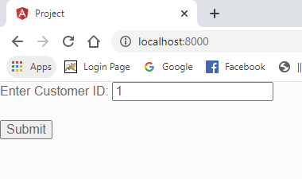
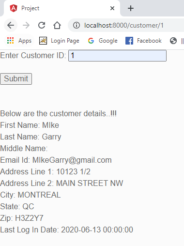

# Electric-Owl

The following document will help you understand how this sample application is developed to render Customer information when a customer id is submitted.

## Database: Creating tables

Creating the following two tables for handling the customer information:

* Table 1 contains the login information and is maintained in `Login_Info` table
* Table 2 contains the information of a customer is maintained in the `Customer` table below.
* Table 3 contains the address information of a customer is maintained in the `Customer_Address` table below.

### Database Mapping

### Stored procedure returns the customer information

The developed [stored procedure](./Stored-procedure.sql) will retain the complete customer information for the submitted customer's id.

* The API endpoint information is stored in the following file: [Customer API](./CustomerAPI.rar)
* The following file contains the database back up: [Sample.bak](./Sample.bak)

*Note:* Please unzip the files as they are zipped in rar. 

## Creating a MVC layout 

The developed MVC layout will display the customer information using the API end point with the input as customer id and returns the customer's information.

## Angular application information

The front end of this appliaction is developed using Angular framework. The file are located

Run the following commands to get started:

> npm install

> npm start

### Front-end UI sample

Initialize the web page for a customer to enter their Customer ID: `1`

Click on `Submit`.

On submitting the ID, the customer details page is displayed where the customer information for the respective Customer ID is displayed:

### How does this application run ?

1. Once the application is loaded, the initial page would be app component which displays an input field so that user can enter Customer ID into the input box.
2. Clicking on `Submit` button below would navigate him to URL "/customer/id" which is configured using angular routing (routerLink concept). This code is availabe in "core module" file.
3. "customer.page.ts" file makes use of the activated route concept to fetch/map the "id" from URL and passes it to the service to fetch data for that particular customer.
4. The service "customer.service.ts" will hit the "customer/:id" endpoint and returns the json value of customer data as an observable.(using rxjs observable conept in angular).
5. This navigates the user to a customer details page where all the details of customer such as first name, last name, address, etc. are displayed.
6. This is an MVC design pattern implemented in Angular framework where "customer.model.ts" file behaves as Model, "customer.page.html" is our View, and "customer.service.ts" is our Controller.

